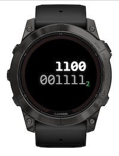
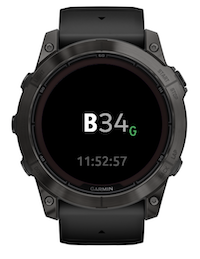

# Garmin Base Time

A minimalist, elegant, nerdy, typography-focused Garmin Connect IQ watch face that displays the current time using base $n$ ($n = 2..16$) numerals.


Available from [Garmin Connect IQ Developer portal](https://apps.garmin.com/apps/0aa8216b-15a2-4fc1-9c7e-9b3731efb8e7) or through the Connect IQ mobile app.

> **Note**  
> Base Time is part of a [collection of unconventional Garmin watch faces](https://github.com/wkusnierczyk/garmin-watch-faces). It has been developed for fun, as a proof of concept, and as a learning experience.
> It is shared _as is_ as an open source project, with no commitment to long term maintenance and further feature development.
>
> Please use [issues](https://github.com/wkusnierczyk/garmin-base-time/issues) to provide bug reports or feature requests.  
> Please use [discussions](https://github.com/wkusnierczyk/garmin-base-time/discussions) for any other comments.
>
> All feedback is wholeheartedly welcome.

## Contents

* [Base n time](#base-n-time)
* [Features](#features)
* [Fonts](#fonts)
* [Build, test, deploy](#build-test-deploy)

## Base n time

A [positional system](https://en.wikipedia.org/wiki/Positional_notation) is a numeral system in which the contribution of a digit to the value of a number is the value of the digit multiplied by a factor determined by the position of the digit.
In the commonly used _decimal_ positional number system, the total value of a numeral is calculated by multiplying each digit by the respective power of 10, and summing those up.

For example, the value of $123_{10}$ (`123` in base 10, or decimal) is calculated as follows: $3 \times 10^0 + 2 \times 10^1 + 1 \times 10^2 = 3 + 20 + 100 = 100$. (Note that the calculation is show in the decimal system.)

Besides decimal, positional systems with other bases are in use. In computing, it is common to represent numbers in _octal_ (base 8) and _hexadecimal_ (base 16) systems.

For example, the value of $123_{16}$ (`123` in base 16, or hexadecimal) is calculated as follows: $3 \times 16^0 + 2 \times 16^1 + 1 \times 16^2 = 3 + 32 + 256 = 291$.  (Note that the calculation is show in the decimal system.)

The Garmin Base Time watch face displays time as hours and minutes in a base-$n$ number system, with the base $n$ set to an integer between 2 and 16.
The following table names the available number systems:

| System       | Base (decimal) | Base (n+1) |
|:-------------|---------------:|-----------:|
| Binary       |              2 |          2 |
| Ternary      |              3 |          3 |
| Quaternary   |              4 |          4 |
| Quinary      |              5 |          5 |
| Senary       |              6 |          6 |
| Septenary    |              7 |          7 |
| Octal        |              8 |          8 |
| Nonary       |              9 |          9 |
| Decimal      |             10 |          A |
| Undecimal    |             11 |          B |
| Duodecimal   |             12 |          C |
| Tridecimal   |             13 |          D |
| Tetradecimal |             14 |          E |
| Pentadecimal |             15 |          F |
| Hexadecimal  |             16 |          G |

**Note**  
The base of the currently used number system is displayed as a subscript, using a smaller, colored font. 
The convention is to use the corresponding numeral in the next higher ($n+1$) number system.
For example:
* The _octal_ (base 8) system is indicated with the digit `8` from the _nonal_ (base 9) system; note that there is no digit `8` in the octal system. (Conveniently, `8` is also a digit in the decimal system, with the same value as `8` in the nonal system.)
* The _hexadecimal_ (base 16) system is indicated with the digit `G` from the _heptadecimal_ (base 17) system; note that there is no digit `G` in the hexadecimal system. (There also is no digit `G` in the decimal system.)

This convention has been chosen to consistently display all system base indicators with one digit.
The alternatve of using the decimal system would lead to double-digit indicators for the decimal system and above.
(Using a base-$n$ numeral to indicate base $n$ was not an option, as in _any_ number system that numeral would be... `10`.)

The base can be selected in the user settings menu in the device.
Optionally, the user may turn on standard time, displayed in smaller font below the decimal time, using on-watch customization settings.


## Features

The Base Time watch face supports the following features:

|Screenshot|Description|
|-|:-|
||**Decimal time**<br /> The current time as decimal numerals, with the suffix `A` (unidecimal for 'ten') indicating the base-10 (decimal) number system. The time is displayed in a single line, with hour digits in white bold font, and minutes digits in light gray regular font.|
||**Binary time**<br /> Time in base-n with n = 2, 3. The time is displayed as hour digits in white bold font in one line, and minutes digits in light gray regular font in the next line. The base can be changed by the user with a setting in the Customize menu on the device.|
||**Standard time**<br /> The standard time is optionally displayed in smaller light gray font beneath the base-n time; here, hexadecimal, with `G` being sixteen in the heptadecimal (base 17) number system. The standard time can be toggled on and of by the user with a setting in the Cutomize menu on the device.<br />Time in base-n with n = 4..16 is displayed in a single line, as in Decimal time above.|

## Fonts

The Base Time watch face uses custom fonts:

* [SUSEMono](https://fonts.google.com/specimen/SUSE+Mono) for the Base-n time (hours and base indicators in SUSEMono-Bold, minutes in SUSEMono-Regular).
* [Ubuntu](https://fonts.google.com/specimen/SUSE+Mono) for standard time (Ubuntu-Regular).

> The development of Garmin watch faces motivated the implementation of two useful tools:
> * A TTF to FNT+PNG converter ([`ttf2bmp`](https://github.com/wkusnierczyk/ttf2bmp)).  
> Garmin watches use non-scalable fixed-size bitmap fonts, and cannot handle variable size True Type fonts directly.
> * An font scaler automation tool ([`garmin-font-scaler`](https://github.com/wkusnierczyk/garmin-font-scaler)).  
> Garmin watches come in a variety of shapes and resolutions, and bitmap fonts need to be scaled for each device proportionally to its resolution.

The font development proceeded as follows:

* The fonts were downloaded from [Google Fonts](https://fonts.google.com/) as True Type  (`.ttf`) fonts.
* The fonts were converted to bitmaps as `.fnt` and `.png` pairs using the open source command-line [`ttf2bmp`](https://github.com/wkusnierczyk/ttf2bmp) converter.
* The font sizes were established to match the Garmin Fenix 7X Solar watch 280x280 pixel screen resolution.
* The fonts were then scaled proportionally to match other screen sizes available on Garmin watches using the [`garmin-font-scaler`](https://github.com/wkusnierczyk/garmin-font-scaler) tool.

The table below lists all font sizes provided for the supported screen resolutions.


| Resolution |    Shape     |         Element         |       Font       | Size |
| ---------: | :----------- | :---------------------- | :--------------- | ---: |
|  148 x 205 | rectangle    | Double line hour        | SUSEMono bold    |   26 |
|  148 x 205 | rectangle    | Double line minutes     | SUSEMono regular |   26 |
|  148 x 205 | rectangle    | Double line system base | SUSEMono bold    |   13 |
|  148 x 205 | rectangle    | Single line hour        | SUSEMono bold    |   32 |
|  148 x 205 | rectangle    | Single line minutes     | SUSEMono regular |   32 |
|  148 x 205 | rectangle    | Single line system base | SUSEMono bold    |   16 |
|  148 x 205 | rectangle    | Standard time           | Ubuntu regular   |   16 |
|  176 x 176 | semi-octagon | Double line hour        | SUSEMono bold    |   31 |
|  176 x 176 | semi-octagon | Double line minutes     | SUSEMono regular |   31 |
|  176 x 176 | semi-octagon | Double line system base | SUSEMono bold    |   16 |
|  176 x 176 | semi-octagon | Single line hour        | SUSEMono bold    |   38 |
|  176 x 176 | semi-octagon | Single line minutes     | SUSEMono regular |   38 |
|  176 x 176 | semi-octagon | Single line system base | SUSEMono bold    |   19 |
|  176 x 176 | semi-octagon | Standard time           | Ubuntu regular   |   19 |
|  215 x 180 | semi-round   | Double line hour        | SUSEMono bold    |   32 |
|  215 x 180 | semi-round   | Double line minutes     | SUSEMono regular |   32 |
|  215 x 180 | semi-round   | Double line system base | SUSEMono bold    |   16 |
|  215 x 180 | semi-round   | Single line hour        | SUSEMono bold    |   39 |
|  215 x 180 | semi-round   | Single line minutes     | SUSEMono regular |   39 |
|  215 x 180 | semi-round   | Single line system base | SUSEMono bold    |   19 |
|  215 x 180 | semi-round   | Standard time           | Ubuntu regular   |   19 |
|  218 x 218 | round        | Double line hour        | SUSEMono bold    |   39 |
|  218 x 218 | round        | Double line minutes     | SUSEMono regular |   39 |
|  218 x 218 | round        | Double line system base | SUSEMono bold    |   19 |
|  218 x 218 | round        | Single line hour        | SUSEMono bold    |   47 |
|  218 x 218 | round        | Single line minutes     | SUSEMono regular |   47 |
|  218 x 218 | round        | Single line system base | SUSEMono bold    |   23 |
|  218 x 218 | round        | Standard time           | Ubuntu regular   |   23 |
|  240 x 240 | round        | Double line hour        | SUSEMono bold    |   43 |
|  240 x 240 | rectangle    | Double line hour        | SUSEMono bold    |   43 |
|  240 x 240 | round        | Double line minutes     | SUSEMono regular |   43 |
|  240 x 240 | rectangle    | Double line minutes     | SUSEMono regular |   43 |
|  240 x 240 | round        | Double line system base | SUSEMono bold    |   21 |
|  240 x 240 | rectangle    | Double line system base | SUSEMono bold    |   21 |
|  240 x 240 | round        | Single line hour        | SUSEMono bold    |   51 |
|  240 x 240 | rectangle    | Single line hour        | SUSEMono bold    |   51 |
|  240 x 240 | round        | Single line minutes     | SUSEMono regular |   51 |
|  240 x 240 | rectangle    | Single line minutes     | SUSEMono regular |   51 |
|  240 x 240 | round        | Single line system base | SUSEMono bold    |   26 |
|  240 x 240 | rectangle    | Single line system base | SUSEMono bold    |   26 |
|  240 x 240 | round        | Standard time           | Ubuntu regular   |   26 |
|  240 x 240 | rectangle    | Standard time           | Ubuntu regular   |   26 |
|  260 x 260 | round        | Double line hour        | SUSEMono bold    |   46 |
|  260 x 260 | round        | Double line minutes     | SUSEMono regular |   46 |
|  260 x 260 | round        | Double line system base | SUSEMono bold    |   23 |
|  260 x 260 | round        | Single line hour        | SUSEMono bold    |   56 |
|  260 x 260 | round        | Single line minutes     | SUSEMono regular |   56 |
|  260 x 260 | round        | Single line system base | SUSEMono bold    |   28 |
|  260 x 260 | round        | Standard time           | Ubuntu regular   |   28 |
|  280 x 280 | round        | Double line hour        | SUSEMono bold    |   50 |
|  280 x 280 | round        | Double line hour        | SUSEMono bold    |   50 |
|  280 x 280 | round        | Double line minutes     | SUSEMono regular |   50 |
|  280 x 280 | round        | Double line minutes     | SUSEMono regular |   50 |
|  280 x 280 | round        | Double line system base | SUSEMono bold    |   25 |
|  280 x 280 | round        | Double line system base | SUSEMono bold    |   25 |
|  280 x 280 | round        | Single line hour        | SUSEMono bold    |   60 |
|  280 x 280 | round        | Single line hour        | SUSEMono bold    |   60 |
|  280 x 280 | round        | Single line minutes     | SUSEMono regular |   60 |
|  280 x 280 | round        | Single line minutes     | SUSEMono regular |   60 |
|  280 x 280 | round        | Single line system base | SUSEMono bold    |   30 |
|  280 x 280 | round        | Single line system base | SUSEMono bold    |   30 |
|  280 x 280 | round        | Standard time           | Ubuntu regular   |   30 |
|  280 x 280 | round        | Standard time           | Ubuntu regular   |   30 |
|  320 x 360 | rectangle    | Double line hour        | SUSEMono bold    |   57 |
|  320 x 360 | rectangle    | Double line minutes     | SUSEMono regular |   57 |
|  320 x 360 | rectangle    | Double line system base | SUSEMono bold    |   29 |
|  320 x 360 | rectangle    | Single line hour        | SUSEMono bold    |   69 |
|  320 x 360 | rectangle    | Single line minutes     | SUSEMono regular |   69 |
|  320 x 360 | rectangle    | Single line system base | SUSEMono bold    |   34 |
|  320 x 360 | rectangle    | Standard time           | Ubuntu regular   |   34 |
|  360 x 360 | round        | Double line hour        | SUSEMono bold    |   64 |
|  360 x 360 | round        | Double line minutes     | SUSEMono regular |   64 |
|  360 x 360 | round        | Double line system base | SUSEMono bold    |   32 |
|  360 x 360 | round        | Single line hour        | SUSEMono bold    |   77 |
|  360 x 360 | round        | Single line minutes     | SUSEMono regular |   77 |
|  360 x 360 | round        | Single line system base | SUSEMono bold    |   39 |
|  360 x 360 | round        | Standard time           | Ubuntu regular   |   39 |
|  390 x 390 | round        | Double line hour        | SUSEMono bold    |   70 |
|  390 x 390 | round        | Double line minutes     | SUSEMono regular |   70 |
|  390 x 390 | round        | Double line system base | SUSEMono bold    |   35 |
|  390 x 390 | round        | Single line hour        | SUSEMono bold    |   84 |
|  390 x 390 | round        | Single line minutes     | SUSEMono regular |   84 |
|  390 x 390 | round        | Single line system base | SUSEMono bold    |   42 |
|  390 x 390 | round        | Standard time           | Ubuntu regular   |   42 |
|  416 x 416 | round        | Double line hour        | SUSEMono bold    |   74 |
|  416 x 416 | round        | Double line minutes     | SUSEMono regular |   74 |
|  416 x 416 | round        | Double line system base | SUSEMono bold    |   37 |
|  416 x 416 | round        | Single line hour        | SUSEMono bold    |   89 |
|  416 x 416 | round        | Single line minutes     | SUSEMono regular |   89 |
|  416 x 416 | round        | Single line system base | SUSEMono bold    |   45 |
|  416 x 416 | round        | Standard time           | Ubuntu regular   |   45 |
|  454 x 454 | round        | Double line hour        | SUSEMono bold    |   81 |
|  454 x 454 | round        | Double line minutes     | SUSEMono regular |   81 |
|  454 x 454 | round        | Double line system base | SUSEMono bold    |   41 |
|  454 x 454 | round        | Single line hour        | SUSEMono bold    |   97 |
|  454 x 454 | round        | Single line minutes     | SUSEMono regular |   97 |
|  454 x 454 | round        | Single line system base | SUSEMono bold    |   49 |
|  454 x 454 | round        | Standard time           | Ubuntu regular   |   49 |


## Build, test, deploy

To modify and build the sources, you need to have installed:

* [Visual Studio Code](https://code.visualstudio.com/) with [Monkey C extension](https://developer.garmin.com/connect-iq/reference-guides/visual-studio-code-extension/).
* [Garmin Connect IQ SDK](https://developer.garmin.com/connect-iq/sdk/).

Consult [Monkey C Visual Studio Code Extension](https://developer.garmin.com/connect-iq/reference-guides/visual-studio-code-extension/) for how to execute commands such as `build` and `test` to the Monkey C runtime.

You can use the included `Makefile` to conveniently trigger some of the actions from the command line.

```bash
# build binaries from sources
make build

# run unit tests -- note: requires the simulator to be running
make test

# run the simulation
make run

# clean up the project directory
make clean
```

To sideload your application to your Garmin watch, see [developer.garmin.com/connect-iq/connect-iq-basics/your-first-app](https://developer.garmin.com/connect-iq/connect-iq-basics/your-first-app/).
